# Оглавление 
- [Part 1. Установка ОС](#zagolovok1)
- [Part 2. Создание пользователя](#zagolovok2)
- [Part 3. Настройка сети ОС](#zagolovok3)
- [Part 4. Обновление ОС](#zagolovok4)
- [Part 5. Использование команды sudo](#zagolovok5)
- [Part 6. Установка и настройка службы времени](#zagolovok6)
- [Part 7. Установка и использование текстовых редакторов](#zagolovok7)
- [Part 8. Установка и базовая настройка сервиса SSHD](#zagolovok8)
- [Part 9. Установка и использование утилит top, htop](#zagolovok9)
- [Part 10. Использование утилиты fdisk](#zagolovok10)
- [Part 11. Использование утилиты df](#zagolovok11)
- [Part 12. Использование утилиты du](#zagolovok12)
- [Part 13. Установка и использование утилиты ncdu](#zagolovok13)
- [Part 14. Работа с системными журналами](#zagolovok14)
- [Part 15. Использование планировщика заданий CRON](#zagolovok15)

## Part 1. Установка ОС 

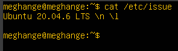 

## Part 2. Создание пользователя 

sudo adduser avassko

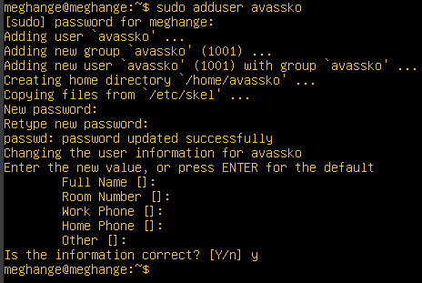

sudo usermod -aG adm avassko – команда добавления пользователя в группу adm

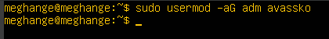

cat /etc/passwd

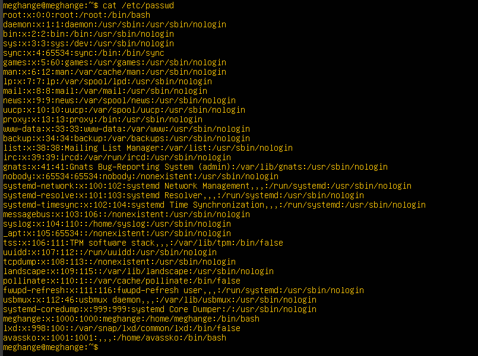

## Part 3. Настройка сети ОС 
### 3.1. Зададим название машины user-1

sudo hostnamectl set-hostname user-1

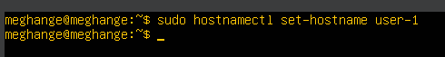

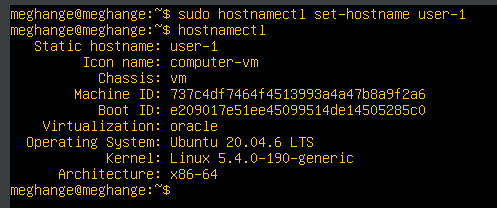

Sudo nano /etc/hostname

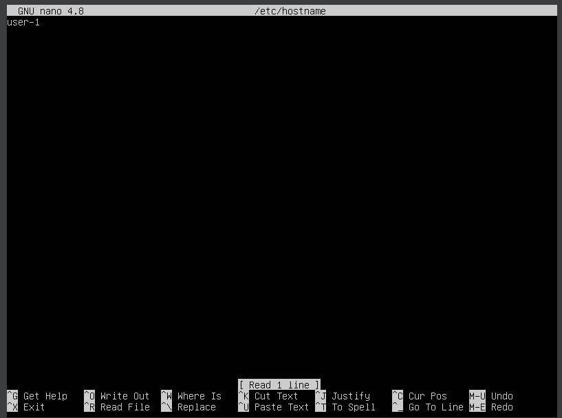

### 3.2. Установка временной зоны, соответствующей текущему местоположению

sudo timedatectl set-timezone Europe/Moscow

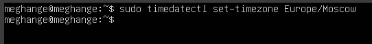

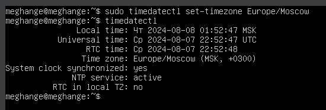

### 3.3. Вывод названия сетевых интерфейсов с помощью консольной команды

ip link show

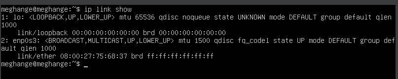

Интерфейс lo (loopback) — это специальный сетевой интерфейс, который используется для обратной связи между процессами на одном хосте. Он позволяет программам общаться друг с другом внутри одной машины, минуя внешнюю сеть. Это полезно для тестирования сетевых сервисов локально, без необходимости подключения к внешней сети.

ls /sys/class/net

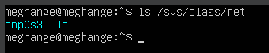

### 3.4. Получение ip адрес устройства от DHCP сервера.

DHCP (Dynamic Host Configuration Protocol) — это сетевой протокол, который позволяет устройствам автоматически получать IP-адрес и другую конфигурационную информацию, необходимую для работы в сети. DHCP-сервер управляет пулом IP-адресов и назначает их устройствам в сети на временной основе. Это упрощает управление сетевыми настройками, поскольку администратору не нужно вручную назначать IP-адреса каждому устройству.

ip addr show

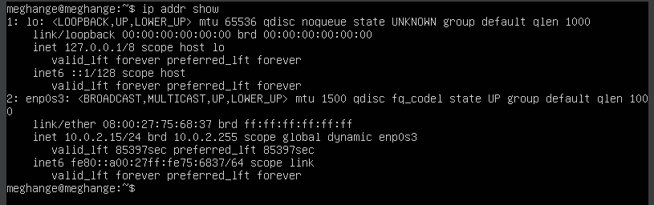

### 3.5. Определение и вывод на экран внешнего ip-адреса шлюза (ip) и внутреннего IP-адреса шлюза, он же ip-адрес по умолчанию (gw).

ip rout | grep default

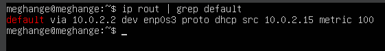

curl ifconfig.me

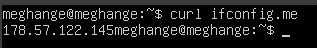

### 3.6. Статичные (заданные вручную, а не полученные от DHCP сервера) настройки ip, gw, dns (использование публичного DNS сервера, например 1.1.1.1 или 8.8.8.8).

sudo nano /etc/netplan/*.yaml

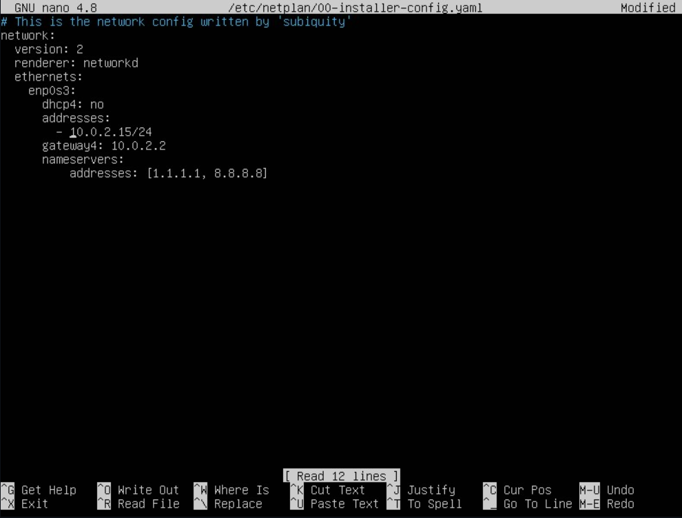

sudo netplan apply – применение изменений 

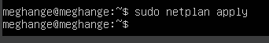

### 3.7. Статические сетевые настройки (ip, gw, dns) соответствуют настройкам, заданным в предыдущем пункте.

ping 1.1.1.1

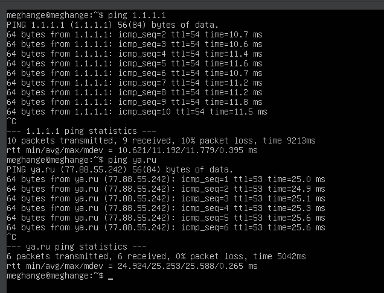

## Part 4. Обновление ОС 

sudo apt-get update

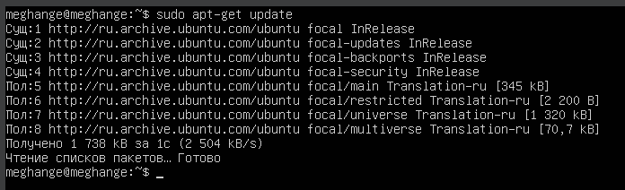

sudo apt-get upgrade

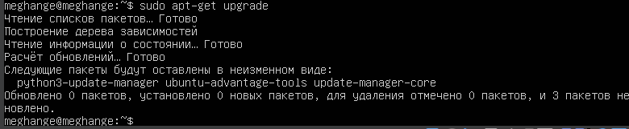

sudo apt-get dist-upgrade

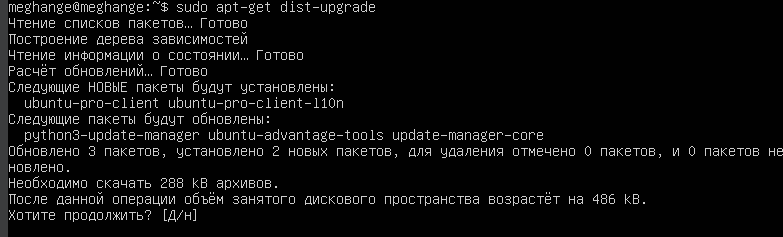

sudo apt update

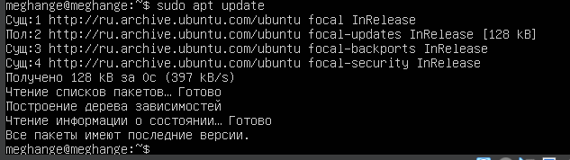

## Part 5. Использование команды sudo 

sudo usermod -aG sudo avassko

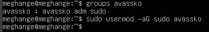

sudo hostnamectl set-hostname s21-server

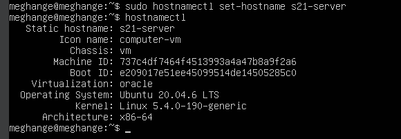

Команда sudo (SuperUser DO) используется для выполнения команд с привилегиями суперпользователя или другого пользователя. Она предоставляет возможность запускать программы с правами другого пользователя, который имеет права суперпользователя.

## Part 6. Установка и настройка службы времени 

sudo systemctl enable systemd-timesyncd
sudo systemctl start systemd-timesyncd
sudo systemctl status systemd-timesyncd

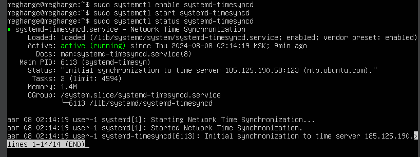

timedatectl show | grep NTPSynchronized

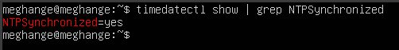

## Part 7. Установка и использование текстовых редакторов 
### 7.1. Установка текстовых редакторов

sudo apt install vim

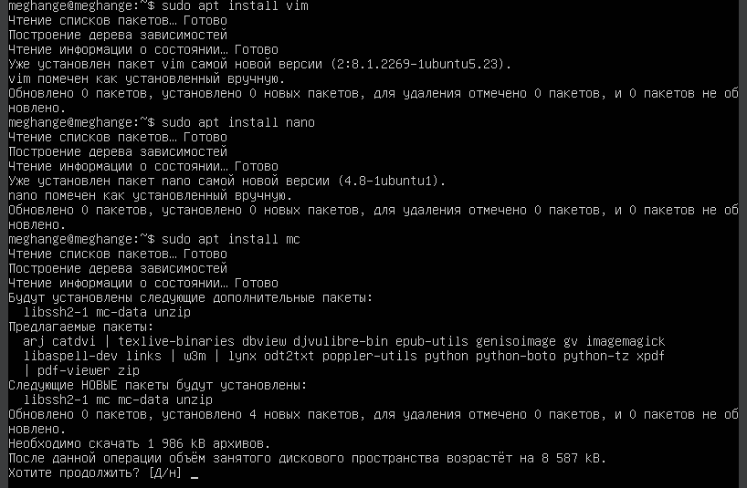

sudo apt install nano и sudo apt install mc по такому же принципу.

### 7.2. Создание файлов

vim test_vim.txt
После открытия файла нажать i, чтобы перейти в режим вставки.
Ввести текст meghange.
Нажать Esc, чтобы выйти из режима вставки.
Ввести :wq и нажать Enter, чтобы сохранить изменения и закрыть файл.

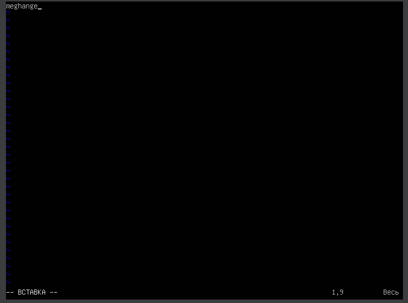

nano test_nano.txt
Ввести текст meghange.
Нажать Ctrl+O, затем Enter, чтобы сохранить изменения.
Нажать Ctrl+X, чтобы закрыть редактор.

Нажать F9 для доступа к верхнему меню, выбрать Команда -> Создать новый файл.
Ввести имя файла test_mcedit.txt и нажать Enter.
После создания файла выбрать его и нажать F4 для открытия в редакторе MCEdit.
Ввести текст meghange.
Сохранить изменения, нажав F2, затем закрыть редактор, нажав Esc -> y -> Enter.

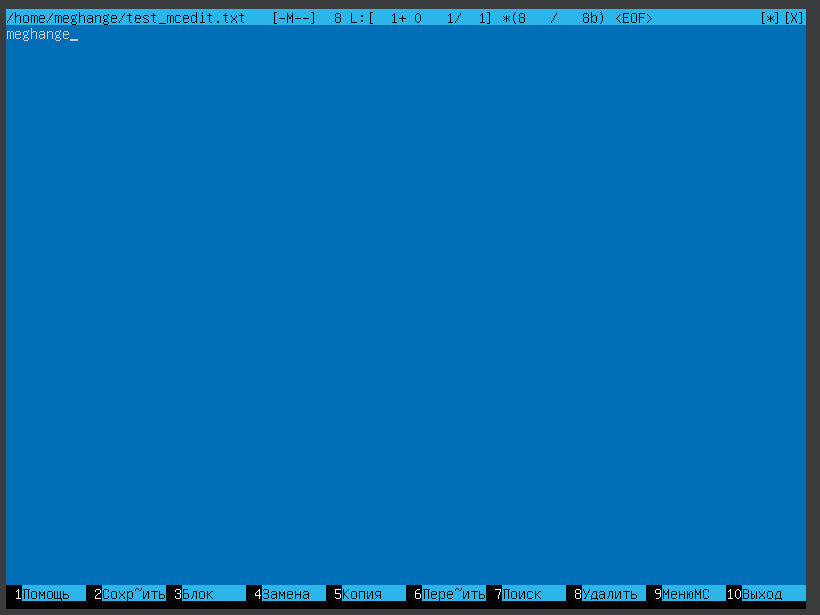

### 7.3. Редактирование  файла, замена никнейма на строку «21 School 21», закрытие файла без сохранения изменений.

vim test_vim.txt

Для замены строки используется следующая команда:
:%s/meghange/21 School 21/g Эта команда найдёт все вхождения "meghange" и заменит их на "21 School 21".
Чтобы закрыть файл без сохранения изменений, надо ввести :q!

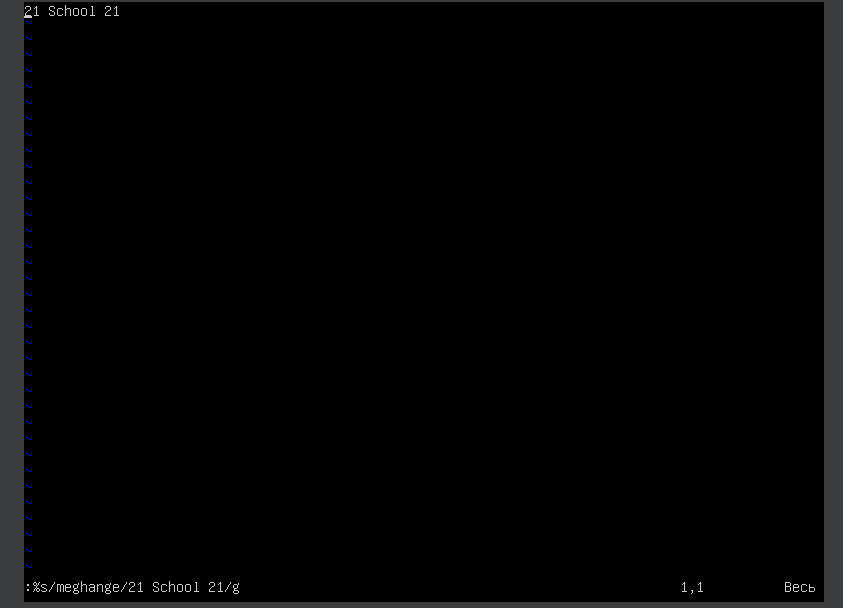

nano test_nano.txt

Для замены строки используется комбинация клавиш Ctrl+\, затем вводится "meghange" как строка поиска и "21 School 21" как новое значение. Нажать A для подтверждения глобальной замены.
Чтобы закрыть файл без сохранения изменений, нажать Ctrl+X, затем N.

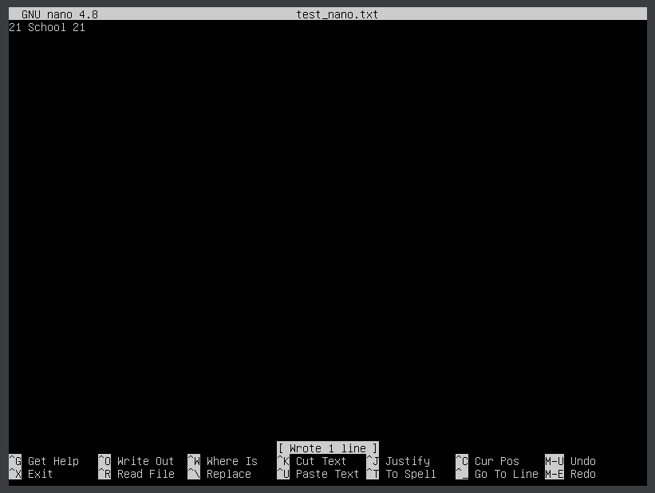

mc

Открыть файл для редактирования, нажав F4. Это откроет файл в встроенном текстовом редакторе MCEDIT.
Для замены строки используется комбинация клавиш Ctrl+W, затем ввести "meghange" как исходную строку и "21 School 21" как новую строку. Нажать Enter для подтверждения замены.
Чтобы закрыть файл без сохранения изменений, нажать Esc, затем выбрать "No" при предложении сохранить изменения.

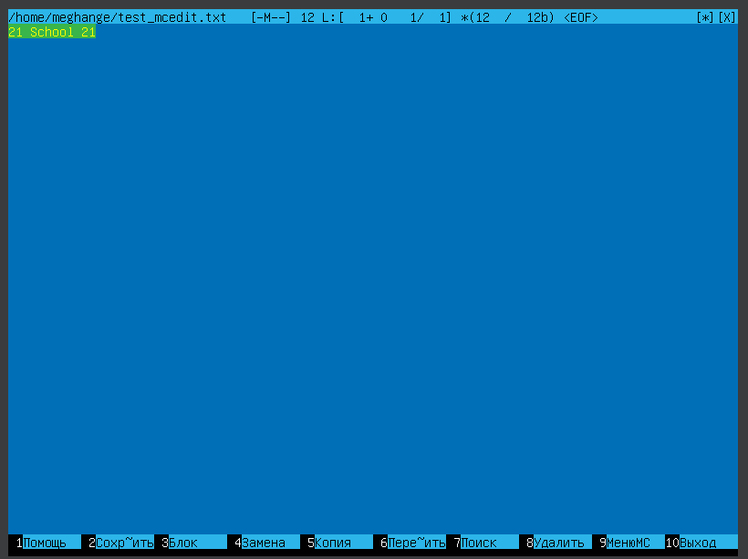

### 7.4. Редактирование файла ещё раз (по аналогии с предыдущим пунктом), а затем ввод функции поиска по содержимому файла (слово) и замены слова на любое другое.

vim test_vim.txt

Для поиска слова используется команда /слово, где "слово" - это то, что надо найти найти.
Чтобы заменить первое найденное вхождение слова в текущей строке, используется команда cw после того, как нашли слово, затем вводится новое слово и нажать Enter.
Для замены всех вхождений слова в файле используется команда :%s/старое_слово/новое_слово/g. Здесь % указывает на все строки файла, s - команда замены, g - глобальная замена во всей строке.
Сохранить изменения и выйти :wq.

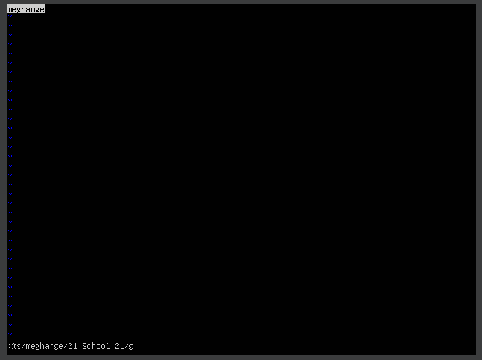

nano test_nano.txt

Для поиска слова используется сочетание клавиш Ctrl + W, затем вводится слово и нажать Enter.
Замена в NANO происходит через меню редактирования. Найти нужное место и вручную изменить текст.
Сохранить изменения, нажав Ctrl + O, затем подтвердить имя файла и нажать Enter.
Выход из NANO - Ctrl + X.

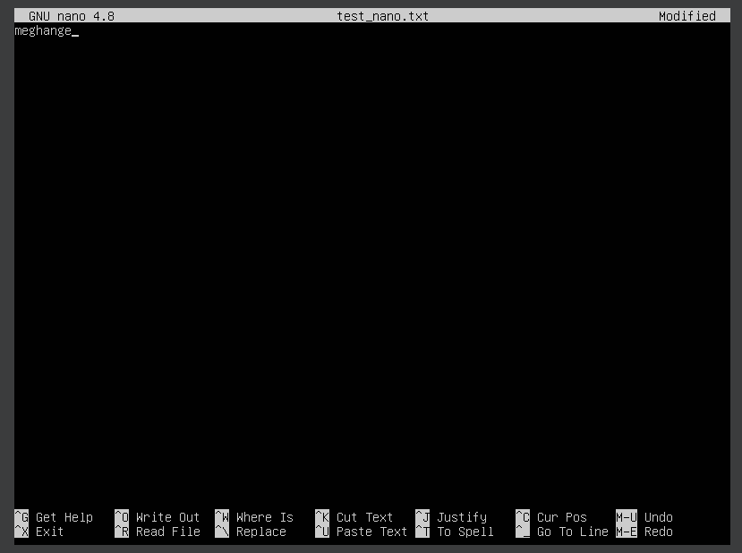

mc

В Midnight Commander перейти к файлу, который надо редактировать, и открыть его с помощью F4.
Для поиска слова используется сочетание клавиш Ctrl + W (или F7), ввести слово и нажать Enter.
Замена в MCEdit происходит через меню Ctrl + \. Указать старое и новое слово, а также диапазон замены. Также возможна замена вручную.
Сохранить изменения, выбрав "File" -> "Save", или используя сочетание клавиш F2.
Выход из редактора - F10 или через меню "File" -> "Quit".

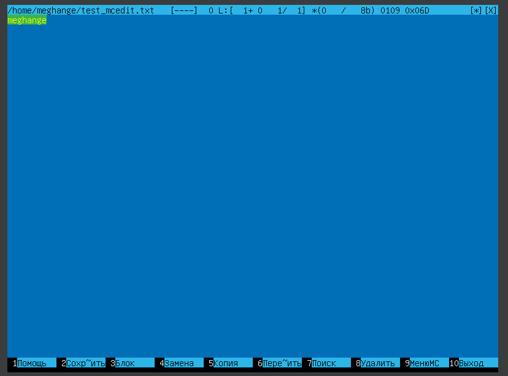

## Part 8. Установка и базовая настройка сервиса SSHD 
### 8.1. Установка службы SSHd.

sudo apt update && sudo apt install openssh-server -y

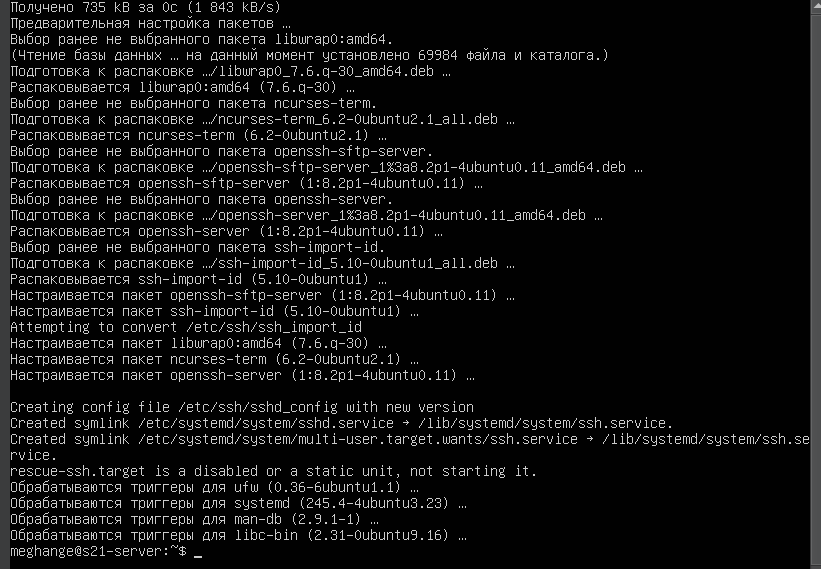

### 8.2. Добавление автостарта службы при загрузке системы.

Чтобы служба SSHd автоматически запускалась при загрузке системы, используется команда:
sudo systemctl enable ssh

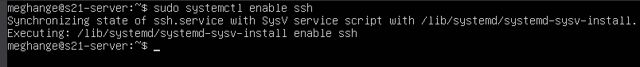

### 8.3. Перенастройка службы SSHd на порт 2022.

sudo nano /etc/ssh/sshd_config – открытие файла
Найти строку #Port 22 и изменить её на Port 2022. Сохранить изменения и закрыть редактор.

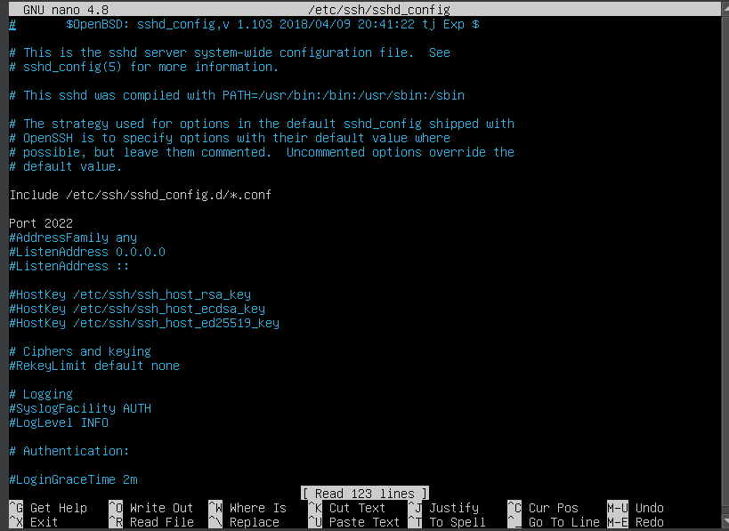

Чтобы применить изменения, перезапустите службу SSH с помощью команды:
sudo systemctl restart ssh

### 8.4. Проверка наличия процесса sshd. 

Использовать для проверки наличия процесса sshd команду:
ps aux | grep sshd
ps — команда для просмотра информации о запущенных процессах.
aux — ключи команды ps:
a — показать процессы всех пользователей на системе.
u — отобразить подробную информацию о каждом процессе.
x — включить в вывод процессы, не управляемые терминалом.
grep sshd — фильтрует вывод команды ps, оставляя только строки, содержащие "sshd".

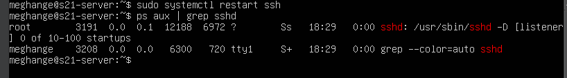

netstat -tan

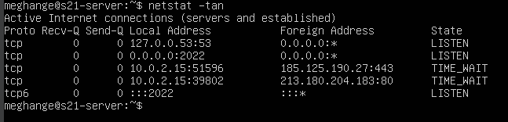

-t — показать TCP соединения.
-a — показать все соединения и прослушивающие порты.
-n — отображать адреса и номера портов в числовом виде.

Строка, содержащая 0.0.0.0:2022 означает, что служба SSHd прослушивает порт 2022 на всех сетевых интерфейсах (0.0.0.0).

Протокол (Protocol): Указывает протокол соединения, например, tcp, udp.

Локальный адрес (Local Address): Адрес и порт на локальной машине, к которым привязано соединение или прослушивание порта.

Внешний адрес (Foreign Address): Адрес и порт удаленной машины, с которой установлено соединение или ожидается соединение.

Состояние (State): Состояние соединения, например, ESTABLISHED для установленных соединений, LISTEN для портов, которые ожидают входящих соединений.

Адрес 0.0.0.0 в контексте сетевых соединений имеет несколько значений в зависимости от его использования:

В качестве IP-адреса сервера (0.0.0.0 в столбце "Локальный адрес"): Означает, что сервер прослушивает все доступные сетевые интерфейсы. То есть, если у вас есть несколько сетевых интерфейсов, и вы хотите, чтобы ваш сервер был доступен через любой из них, вы можете использовать 0.0.0.0 как адрес прослушивания.

В качестве IP-адреса клиента (0.0.0.0 в столбце "Внешний адрес"): Обычно указывает на то, что соединение еще не было полностью установлено, и удаленный адрес еще неизвестен.

### 8.5. Перезагрузка системы.

sudo reboot

## Part 9. Установка и использование утилит top, htop 

Установка top и htop с помощью команды:
sudo apt install top htop -y

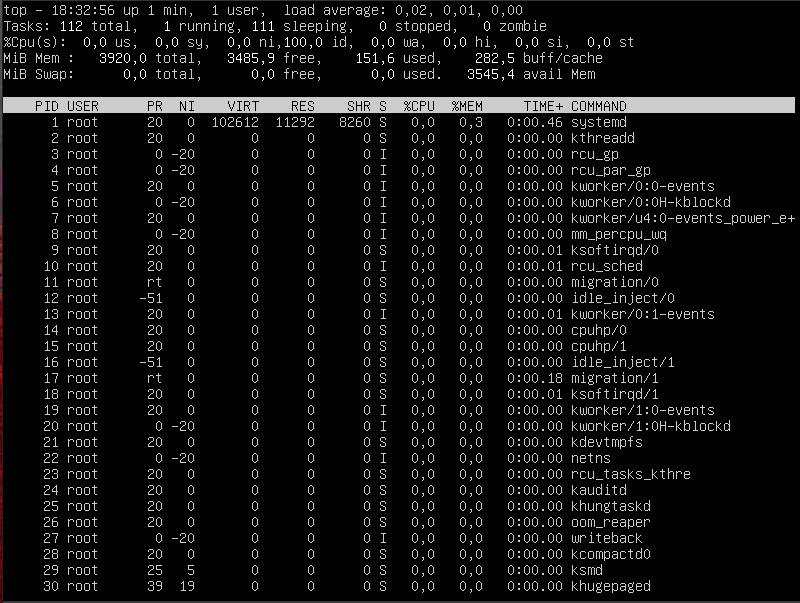

Время безотказной работы: 18:32:56.
Количество авторизованных пользователей: 1.
Общая загрузка системы: 0.00, 0.00, 0.00 (минуту, 5 минут, 15 минут назад).
Общее количество процессов: 112.

Загрузка CPU: 
- us (User): 0.0 Процессорное время, затраченное на выполнение пользовательских процессов. Пользовательские процессы — это программы, запущенные в результате действий пользователя, например, текстовые редакторы, браузеры и т.д.
- sy (System): 0.0 Процессорное время, затраченное на выполнение системных вызовов операционной системы. Системные вызовы включают в себя функции, управляемые ядром, такие как чтение и запись данных, управление памятью и сетевыми операциями.
- ni (Nice): 0.0 Процессорное время, затраченное на выполнение процессов с приоритетом "nice". Эти процессы были запущены с измененным приоритетом, чтобы они использовали меньше ресурсов процессора по сравнению с другими процессами.
- id (Idle): 100.0 Процессорное время, когда процессор простаивал, не выполняя никаких задач. Это время, когда процессор не занят выполнением ни одного из вышеупомянутых типов задач.
- wa (I/O Wait): 0.0 Процессорное время, затраченное на ожидание завершения ввода-вывода. Это может быть связано с операциями чтения и записи на диске или через сетевые интерфейсы.
- hi (Hardware Interrupts): 0.0 Количество прерываний оборудования, которые требуют внимания процессора. Это могут быть прерывания от аппаратных устройств, таких как устройства ввода/вывода, сетевые карты и т.д.
- si (Software Interrupts): 0.0 Количество прерываний программного обеспечения, которые требуют внимания процессора. Это обычно связаны с выполнением системных вызовов и обработкой исключений.
- st (Steal Time): 0.0 Время, которое был бы потрачен процессором, если бы он работал в гипервизоре, но было перенаправлено на выполнение других виртуальных машин. Этот показатель актуален только для систем с поддержкой виртуализации. 
Загрузка памяти: 3485.9 свободно, 151.6 занято.

Для использования htop с дополнительными параметрами:
Запустить htop с помощью команды:

htop

Чтобы отсортировать процессы по PID, PERCENT_CPU, PERCENT_MEM, TIME, используются клавиши управления в htop:
Для сортировки по PID: Press F6, выбрать "PID" и нажать Enter.
Для сортировки по PERCENT_CPU: Press F6, выбрать "CPU%" и нажать Enter.
Для сортировки по PERCENT_MEM: Press F6, выбрать "MEM%" и нажать Enter.
Для сортировки по TIME: Press F6, выбрать "TIME" и нажать Enter.

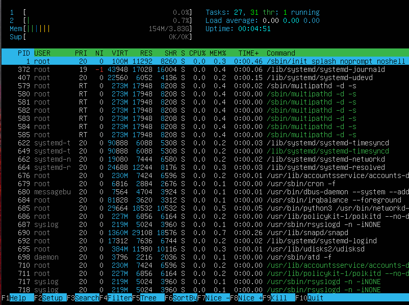

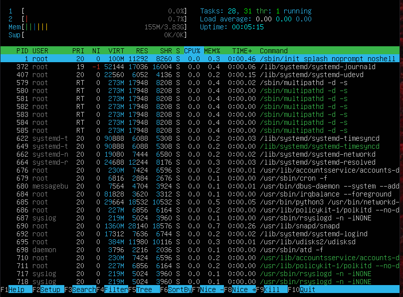

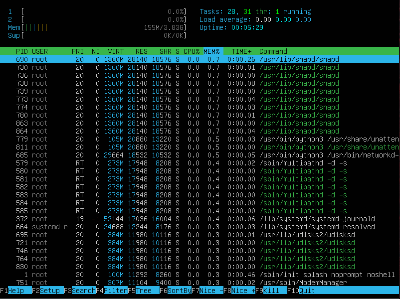

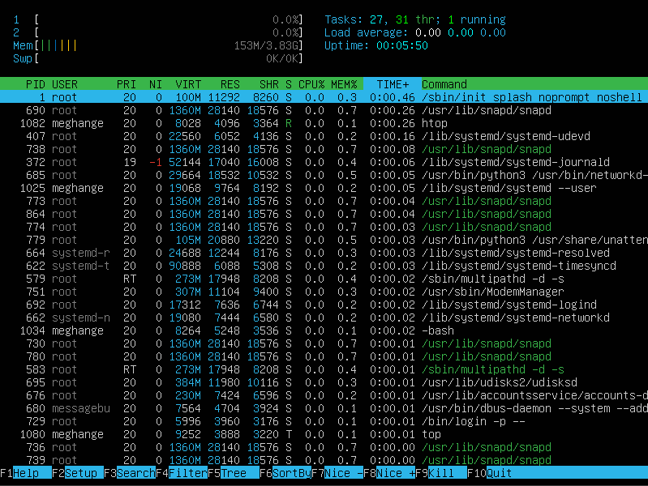

Чтобы отфильтровать процессы для sshd, используется клавиша F4, ввести sshd и нажать Enter

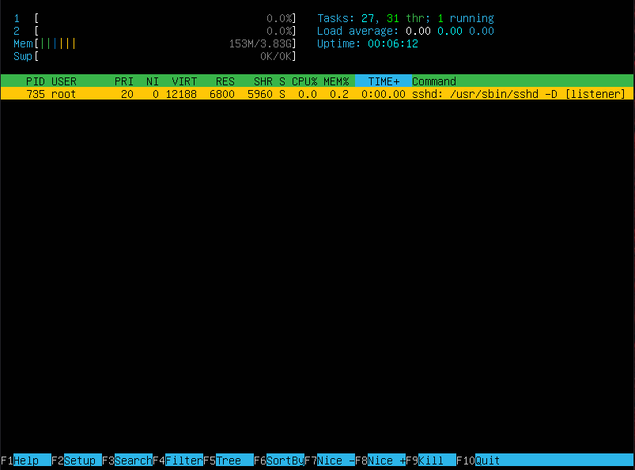

Чтобы добавить вывод hostname, clock и uptime, используется клавиша F2, затем выбираются нужные опции, нажимается Enter.

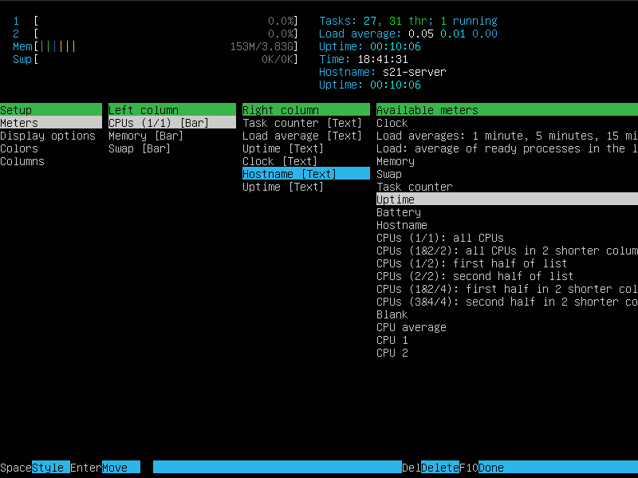

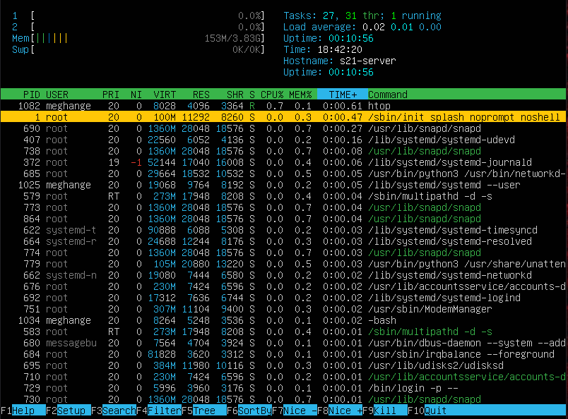

Поиск процесса syslog в htop:
После запуска htop, нажать F4 для открытия поля фильтра.
Ввести имя процесса, который надо найти (syslog) и нажать Enter. htop автоматически отфильтрует список процессов, оставив только те, которые соответствуют запросу.

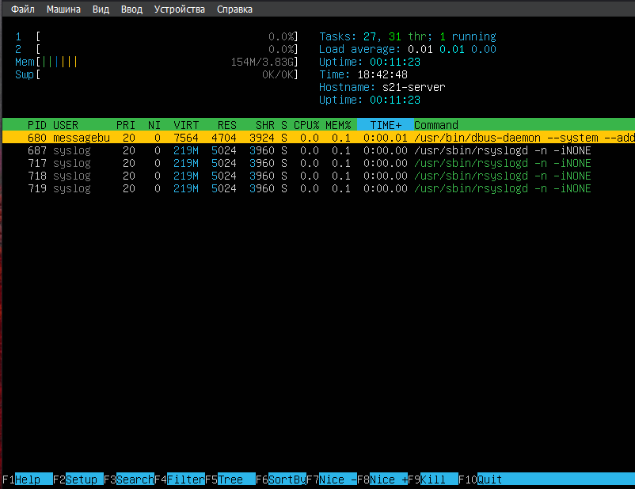

## Part 10. Использование утилиты fdisk 

Чтобы получить информацию о всех подключенных дисках, включая их размеры и разделы, используйте следующую команду:
sudo fdisk -l

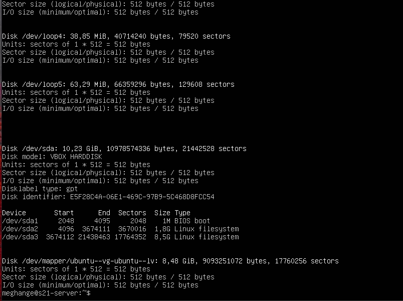

Название Жесткого Диска: model VBOX HARDDISK.
Размер: /dev/sda: 10.23GiB 
Количество Секторов: 21142528.

free -h

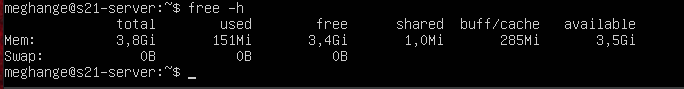

Размер Swap:  0B

## Part 11. Использование утилиты df 

df -h /   в гигабайтах

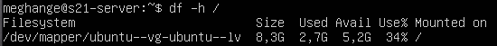

Размер раздела: 8.3
Использованное пространство: 2.7
Свободное пространство: 5.2
Процент использования: 34%

df / в байтах 

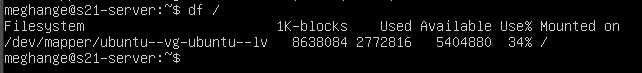

Размер раздела: 8638084
Использованное пространство: 2772816
Свободное пространство: 5404880
Процент использования: 34%

df -Th /
Флаг -T добавляет информацию о типе файловой системы к выводу.

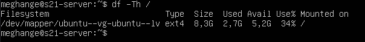

Размер раздела: 8.3
Использованное пространство: 2.7
Свободное пространство: 5.2
Процент использования: 34%
Тип файловой системы: ext4

## Part 12. Использование утилиты du 

Чтобы получить размер папок /home, /var, и /var/log в человекочитаемом формате (в байтах), используется следующая команда:
du -s /home /var /var/log
du -s /var
du -s /var/log
Здесь:
-s означает "сводный" (summary), что позволяет получить общий размер каждой директории.

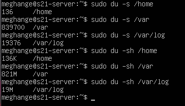

sudo du -sh /var/log/*
du: это команда Unix/Linux, которая используется для оценки и отображения размера файлов и директорий.
-h: человекочитаемый вывод, что означает, что команда будет выводить размеры в удобочитаемых единицах (например, KB, MB, GB).
/var/log/*: указывает на то, что команда должна применяться ко всем файлам и директориям внутри /var/log.

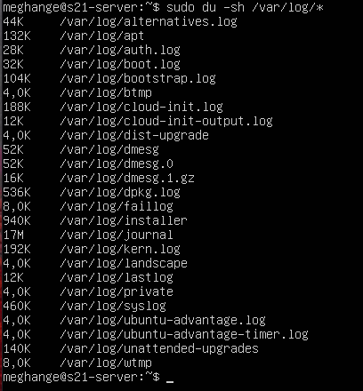

## Part 13. Установка и использование утилиты ncdu 

Команда для установки ncdu:
sudo apt install ncdu 

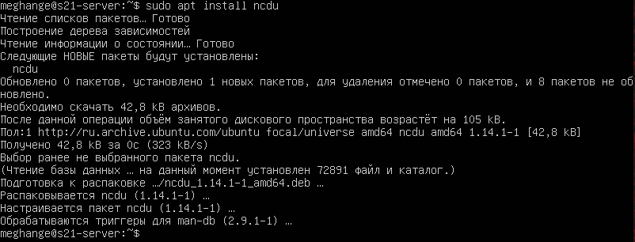

Использование дискового пространства:
sudo ncdu /home

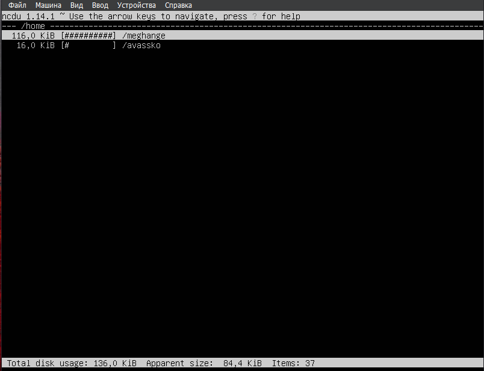

sudo ncdu /var

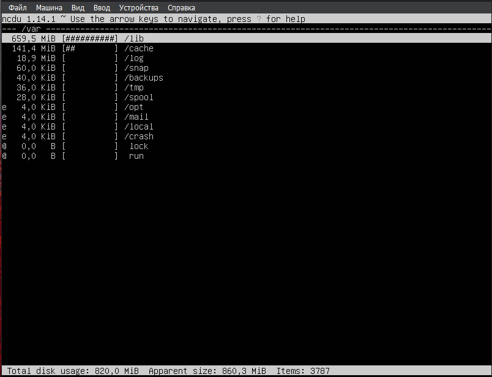

sudo ncdu /var/log

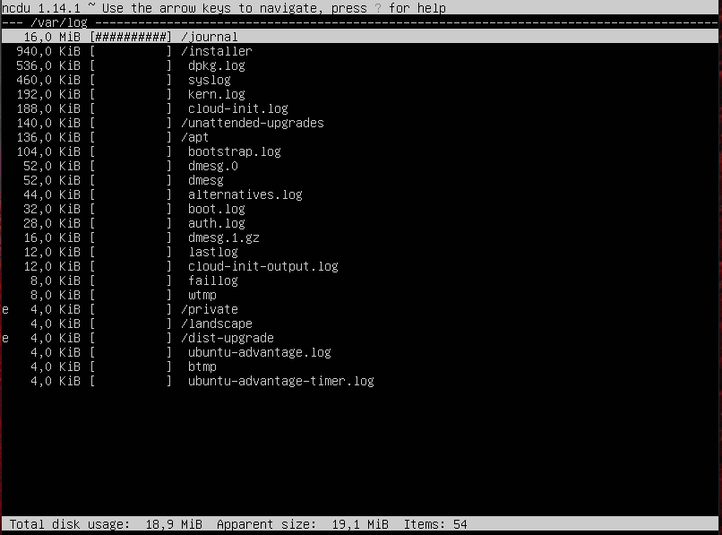

## Part 14. Работа с системными журналами 

Чтобы просмотреть содержимое файла /var/log/dmesg, используйте команду cat или less. 
Например:
sudo dmesg

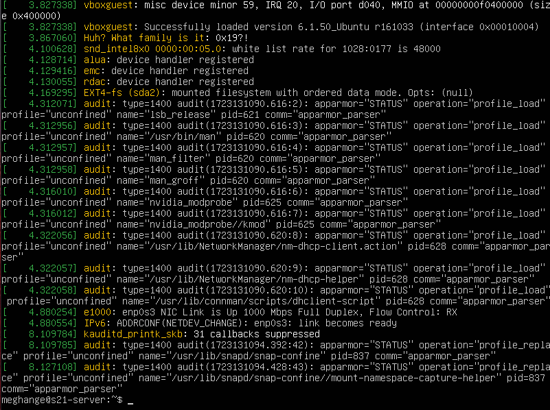

sudo less /var/log/syslog

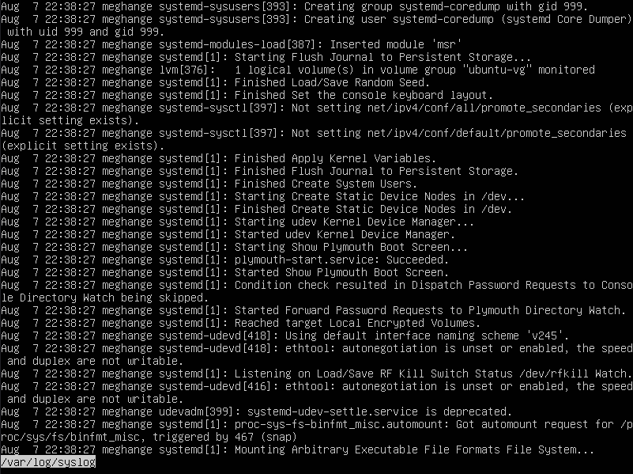

sudo less /var/log/auth.log

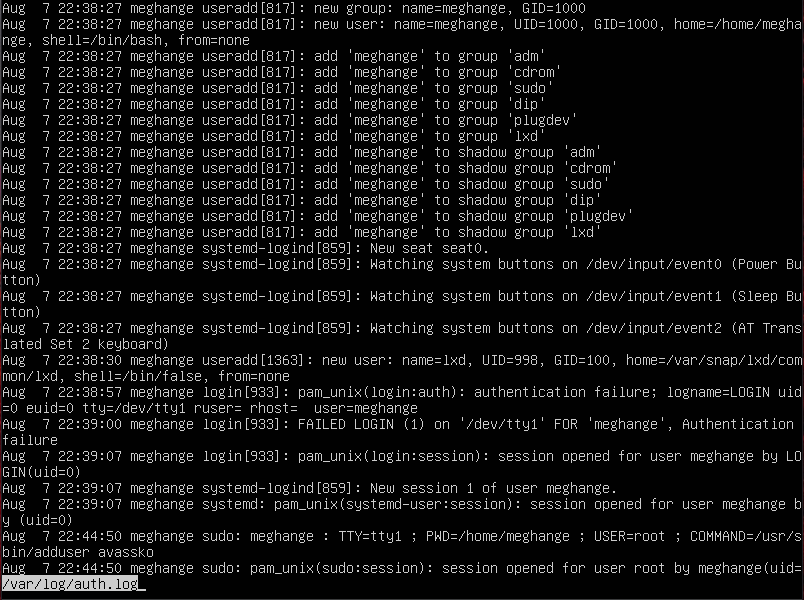

чтобы найти последнюю успешную авторизацию через SSH, можно использовать:
sudo grep -i ssh /var/log/auth.log | tail

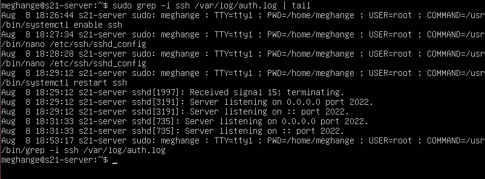

время последней успешной авторизации: Aug 8 18:53:17 
имя пользователя: meghange 
метод входа в систему: sudo

Для перезапуска службы SSHD используется команда:
sudo systemctl restart ssh

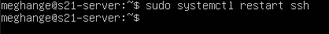

После перезапуска службы SSHD, чтобы найти соответствующее сообщение в логах, надо использовать команду grep снова. Например:
sudo grep -i "restart" /var/log/syslog

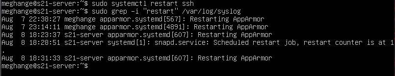

## Part 15. Использование планировщика заданий CRON 

crontab -e
Добавить следующую строку в файл, который откроется:
 /2 * * * * uptime" 
Эта строка означает, что команда uptime будет выполняться каждые 2 минуты (*/2 * * * *).

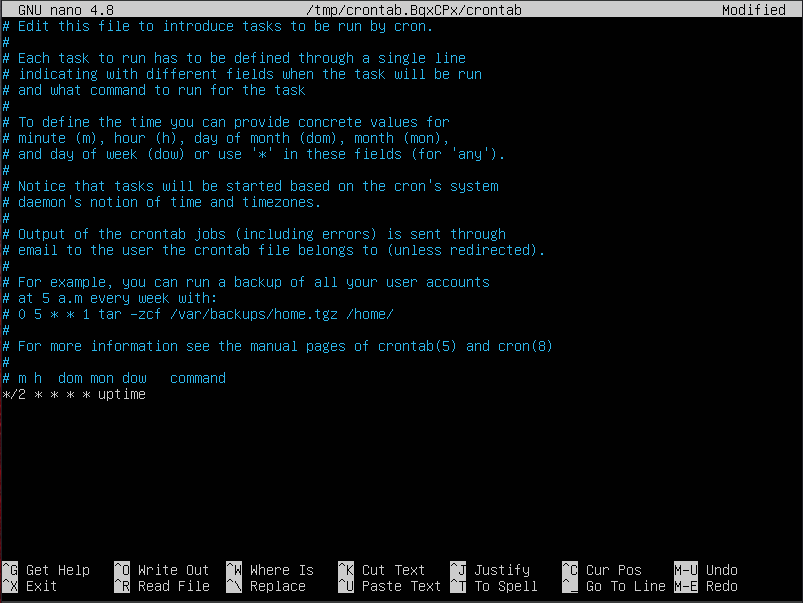

Чтобы найти строки в системных журналах о выполнении задания, используется команда grep:
sudo grep CRON /var/log/syslog 

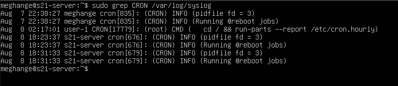

Чтобы получить список всех текущих заданий CRON, используется команда:
crontab -l

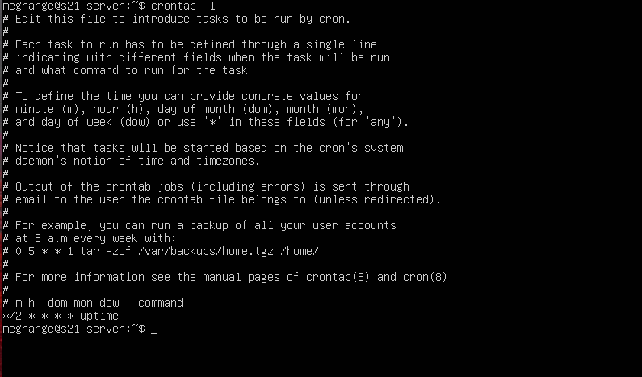

Для удаления всех заданий из планировщика заданий, используется команда:
crontab -r

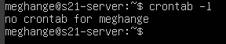
